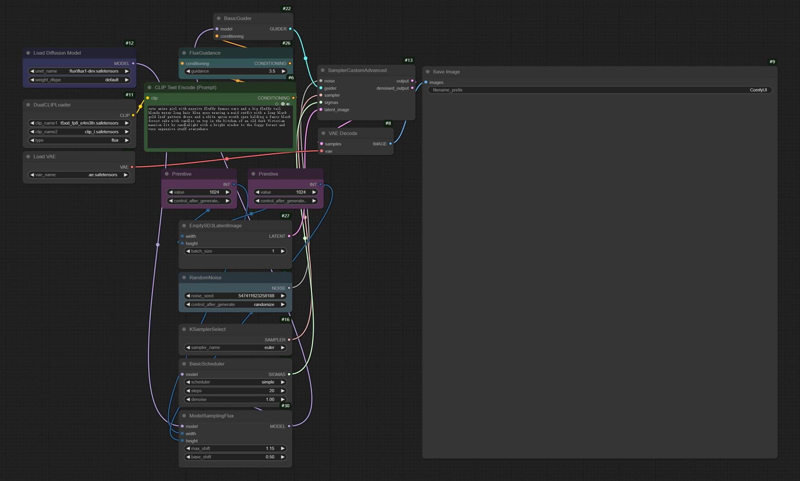

# 描述
本人实测的工作流分享，工作流节点完全开源，所有工作流都可以在小程序《AI图工厂》下载，部署可以通过小程序联系我。
 

    

# 目录

- [1.FLUX1](#-1.FLUX1)
- [2.无损放大8k](#-无损放大8k)

# 1.FLUX1

Flux.1 是由 Black Forest Labs 黑森林实验室推出的文生图模型套件(多个版本)，Flux.1具有出色的文字生成能力和语言理解能力。 FLUX.1 在视觉质量、图像细节方面有显著优势，比如文字生成、复杂构图、人手描绘等方面表现良好。其手部细节得到了优化与增强，相比 Stable Diffusion 模型的畸形手指，FLUX.1 模型要正常得多。图像质量也有所增强，拉近了和最强文生图软件 Midjourney 的距离。 Black Forest Labs，一家由Stability AI的前核心成员Robin Rombach 创立的新团队。

Black Forest Labs 官网： https://blackforestlabs.ai/

## 1.1 FLUX1 文生图基础工作流

### FLUX1 文生图基础工作流-官方原始工作流
目前 Flux.1 官方推出的 3 个版本，Flux.1 Pro 、Flux.1 Dev和Flux.1 Schnell，Flux1 Dev和Flux.1 Schnell是开源版本，官方版本对硬件要求较高，目前已经有诸多开源版本，对硬件要求较低，可以按需选择。
#### 原始版本硬件要求
官方原始版本对硬件要求较高，最低显存要求：8-12GB或更高（渲染速度较慢） 推荐显存：16-24GB。

#### 原始版本依赖模型
Black Forest Labs 官方版本模型：
 
大模型下载地址(二选一)：
<a href="https://huggingface.co/black-forest-labs/FLUX.1-dev/blob/main/flux1-dev.safetensors">dev（16G显存以上）</a>，
<a href="https://huggingface.co/black-forest-labs/FLUX.1-schnell">schnell（推荐）</a>，存放到 ComfyUI/models/unet
 
clip模型下载地址：
<a href="https://huggingface.co/comfyanonymous/flux_text_encoders/blob/main/clip_l.safetensors">clip_l</a>，存放到 ComfyUI/models/text_encoders
 
t5xxl模型下载地址(二选一)：
<a href="https://huggingface.co/comfyanonymous/flux_text_encoders/blob/main/t5xxl_fp8_e4m3fn.safetensors">t5xxl_fp8_e4m3fn（推荐）</a>，
<a href="https://huggingface.co/comfyanonymous/flux_text_encoders/blob/main/t5xxl_fp16.safetensors">t5xxl_fp16（24G显存）</a>，存放到 ComfyUI/models/text_encoders
 
vae模型下载地址：<a href="https://huggingface.co/black-forest-labs/FLUX.1-schnell/blob/main/ae.safetensors">ae</a>，存放到 ComfyUI/models/vae

#### 工作流预览

# 2.无损放大8k
主要是使用了放大模型，有2倍、4倍和8倍放大模型。
 
## 放大模型下载地址：
<a href="https://huggingface.co/ai-forever/Real-ESRGAN/blob/main/RealESRGAN_x2.pth">点击下载2倍放大模型</a>
 
<a href="https://huggingface.co/ai-forever/Real-ESRGAN/blob/main/RealESRGAN_x4.pth">点击下载4倍放大模型</a>
 
<a href="https://huggingface.co/ai-forever/Real-ESRGAN/blob/main/RealESRGAN_x4.pth">点击下载8倍放大模型</a>
 
将模型放入models/upscale_models文件夹中，然后使用UpscaleModelLoader节点加载。
## 工作流
扫码进入小程序下载工作流 
### 图片8k无损放大工作流预览

